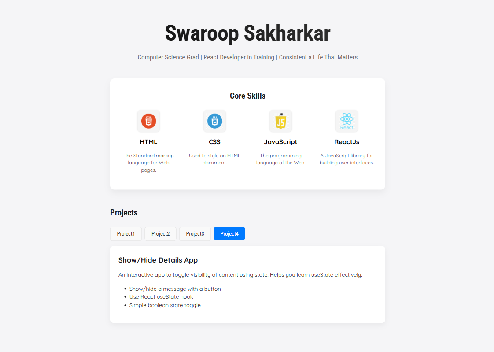
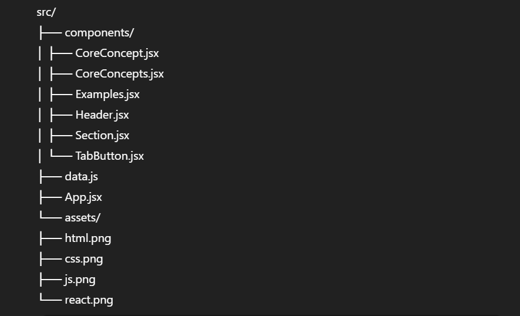

# 💼 Swaroop Sakharkar — React Portfolio

A clean and dynamic portfolio built using React. This project showcases core web development skills alongside interactive mini-projects — all presented in a modern, Apple-inspired UI.


## 📌 About

This portfolio isn't just about code — it's about mindset.  
Featuring a modular React structure, reusable components, and responsive layout, it's a live demonstration of what a disciplined, consistent, and growth-driven developer can build from scratch.


## 🧠 Core Features

- ✅ Component-based structure (`Header`, `CoreConcepts`, `Examples`, etc.)
- ✅ Dynamic tab-based project viewer using React `useState`
- ✅ Skills section featuring HTML, CSS, JavaScript, and React
- ✅ Clean UI inspired by Apple design — gradients, shadows, whitespace
- ✅ Deployment-ready via GitHub Pages


## 📂 Tech Stack

- React (Functional Components)
- JSX
- CSS Modules (or global styling)
- Git & GitHub
- Vite (or CRA if applicable)


## 🗂️ File Structure


## 📜 License
This project is open-source and available under the MIT License.

## 🚀 How to Run Locally

```bash
# Clone the repository
git clone https://github.com/<your-username>/<repo-name>.git
cd <repo-name>

# Install dependencies
npm install

# Start the development server
npm run dev   # (for Vite)
# or
npm start     # (for Create React App)

```bash


